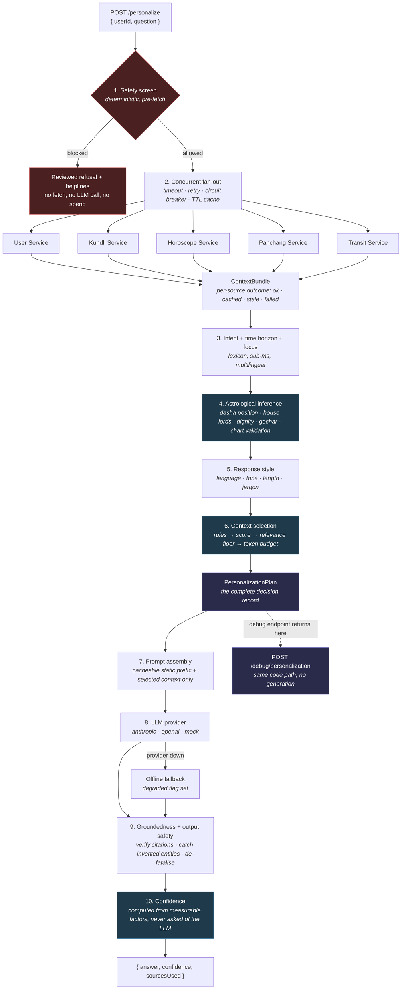
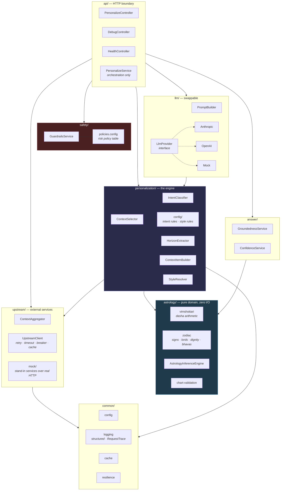
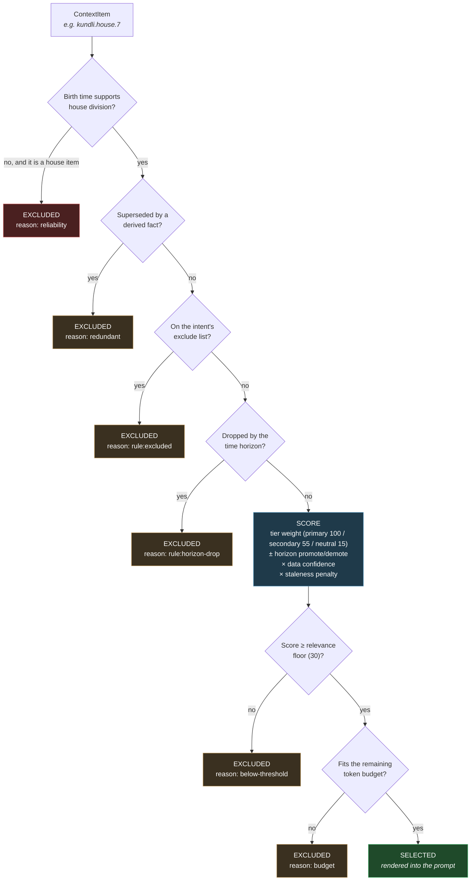

# Architecture

## 1. Request pipeline

Every request walks the same ten stages. `POST /personalize` runs all of them;
`POST /debug/personalization` runs stages 1–7 and returns the plan instead of
generating, which is why the debug view can never drift from real behaviour.

## 2. Layers

Dependencies point downward only. The domain layer has no framework imports and
no I/O, so every astrological rule is testable as a pure function.

## 3. How one context item is decided

Filters that remove items for *correctness* run before scoring, so the token
budget is only ever spent on candidates that are actually admissible. Budget
decides how much of the relevant set fits — never what counts as relevant.

## 4. Where the two axes come from

The brief's example table keys context selection on **intent** alone. Its own
sample questions, however, span four different time frames — "today", "this
week", "this month", "the next few months" — and the right context differs
sharply between them.

|                       | `today`                  | `quarter`                       |
| --------------------- | ------------------------ | ------------------------------- |
| Panchang              | **primary** — it *is* the answer | dropped — describes one day |
| Daily horoscope       | primary                  | secondary                       |
| Current dasha         | secondary                | **primary** — multi-month arc   |
| Dasha transition      | demoted                  | **primary** — chapter boundary  |
| Saturn / Jupiter transit | demoted — years cannot resolve to a day | **promoted** — the multi-month signal |

So selection keys on `(intent × horizon)`, and both live in
`src/personalization/config/intent-rules.config.ts` as data.
